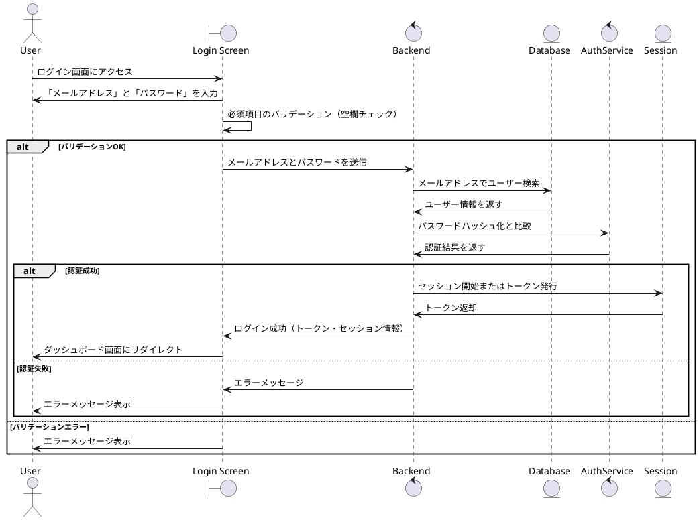
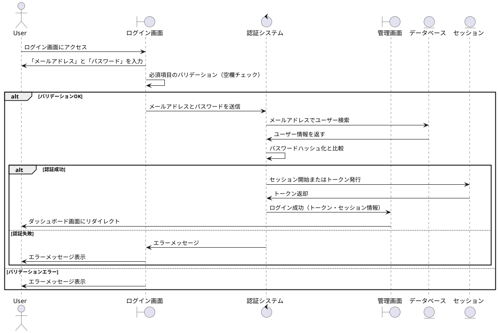

<style type="text/css">
  .reveal h1,
  .reveal h2,
  .reveal h3,
  .reveal h4,
  .reveal h5,
  .reveal h6 {
    text-transform: none;
  }

  .fullscreen {
  width: 100%;
  height: 100%;
  object-fit: cover;
}
</style>
# コードベースでできるあれこれ
---

# 自己紹介
---

### ニックネーム: ざっきー


情報系の専門学校に通っています。  
得意なのは **Webフロントエンド** ですが、最近は興味本位で **Go** を触っています！

---

# コードベースでできるあれこれ
---

## GUIツールを使った作業がたくさん！
- **スライド作成**: PowerPoint  
  *ドラッグ＆ドロップで視覚的に編集可能*
- **設計書作成**: Word  
  *テンプレートを使えばフォーマットも簡単*
- **バージョン管理**: Sourcetree  
  *Git操作がグラフィカルにできる*
- **UML作図**: astah  
  *デザインパターン作図に強み*

---

## GUIツールの魅力
- **直感的に操作可能**  
- **初心者に優しい**  
- **作業が効率的で便利**  

---

## しかし...
---

## GUIツールは万能ではない！
---

## 学校での開発課題でシステム設計を行う気かがあった
- ガントチャートで開発スケジュールを作る
- 必要な機能、画面などを書き出し、設計書を作る
- シーケンス図、ER図などのUMLを作図
<!-- - 私が通っている専門学校には卒業検定という名目の基、チームで企画、設計、実装、テスト、発表を行う機会がある -->
<!-- 設計書の提出を求められる -->
<!-- 学校ではastahというツールを使ってUMLの作図を教えていますが、これが本当に面倒くさいです　開発において設計の大切さは分かっているつもりでも、この面倒くささで嫌いになりました -->
<!-- 設計書にUMLを載せることは求められていても、UMLの作図手順は指定されておらず、もっと簡単にできないか模索 -->
<!-- コードベースで作図できるPlantUMLというものを発見 -->
<!-- 実際に使ってみて、記法を覚えればastahを使うより手軽に作れて修正もしやすい -->
<!-- 他にもバージョン管理できる、チームで共有できる、生成AIと相性がいい、コードを書くengineerとも相性がいいなどメリットがいっぱい -->
<!-- ほかにもコードベースで作れるものはないのか...? -->
<!-- PlantUML, vscode-reveal, swagger -->
---

## ほかにもコードベースで作れるものがあるのではないか...？
---

1. astah → PlantUML（UML）
2. PowerPoint → vscode-reveal（スライド）
3. Word → Swagger（API仕様書）
---

# PlantUML
VSCodeを使ってコードでUMLを作図できる
--

### 実際の開発画面
.png)
--

### PlantUMLで作図できるUML

- ユースケース図
- ロバストネス図
- シーケンス図
- ER図
- クラス図
- アクティビティ図
- 状態遷移図
- その他
--

### ログイン機能に関するシーケンス図を作ってみよう！！
--

### ログイン機能の処理手順
.png)
--

### 処理手順からコードを生成
.png)
--

### コードからシーケンス図を描画

--

### 微調整でいい感じの図に...！！

--

## 背景: GUIツールの限界
### これまでの作業
- **GUIツールが主流**
  - スライド: PowerPoint
  - API設計書: Swagger UI
  - UML: Visio
  - ドキュメント: Confluence

### 課題
- 操作がツールごとに異なる
- バージョン管理が困難
- チームでの共有やコラボが非効率

---

### コードベースで作成するメリット
- 記法に慣れたら手軽に作成できる
- Git / GitHubでチーム作業しやすい
- 生成AIとの相性がいい
---

### 記法に慣れたら手軽に作成できる

--

最初は、記法の理解に時間がかかるが、慣れてきたらGUIで操作するより速く作業できる

Word → Notion

---

## コードベースへのシフト
- **エンジニアに馴染みやすい**  
  - Markdownやコードの記法に抵抗なし  
  - 普段使いのエディタで作業可能 (例: VSCode)

- **Gitで管理可能**  
  - 誰が何を変更したか追跡可能  
  - コンフリクトも効率的に解消  

- **生成AIとの相性が良い**  
  - ドキュメントや設計図を自動生成可能  
  - コードベースで効率化を推進  

---

## コードベースで作れるもの

1. **スライド作成**  
   - Reveal.js + Markdown  
   - `vscode-reveal`を使えばVSCodeでスライド作成
2. **API設計書**  
   - [Swaggo](https://github.com/swaggo/swag)  
   - GoコードコメントからSwagger自動生成
3. **UML**  
   - [PlantUML](https://plantuml.com/)  
   - テキストベースでシーケンス図やクラス図を作成
4. **ドキュメント**  
   - Markdown + GitHub Pages / Notion API  
   - チームで共有・管理可能

---

## メリット: コードベースの強み
### 1. エンジニアに馴染みやすい
- Markdown記法で簡単
- VSCodeで全て完結

### 2. バージョン管理が可能
- Gitを使用
- 複数人で編集しやすい

### 3. 自動化・生成AIの活用
- ChatGPTやAIで補完・生成
- 手作業の効率化

---

## 実例デモ
### スライド作成
```markdown
# タイトル
- **Reveal.js**を使ってMarkdownでスライドを作成
- 実行コマンド: `vscode-reveal`