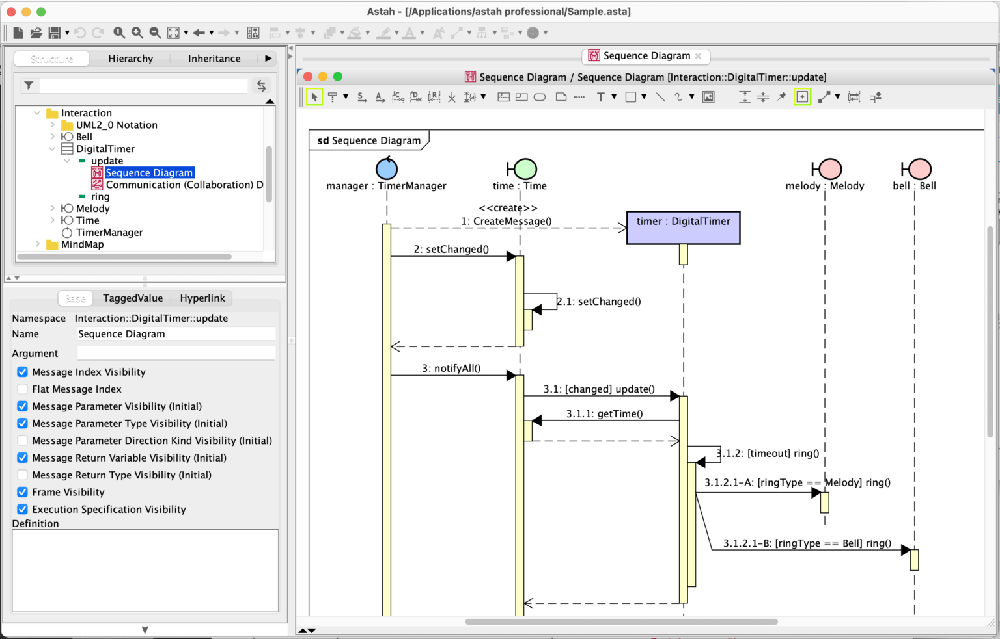
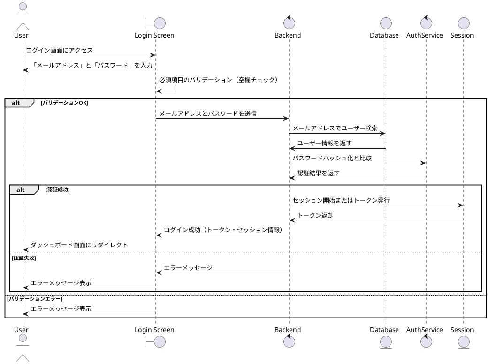
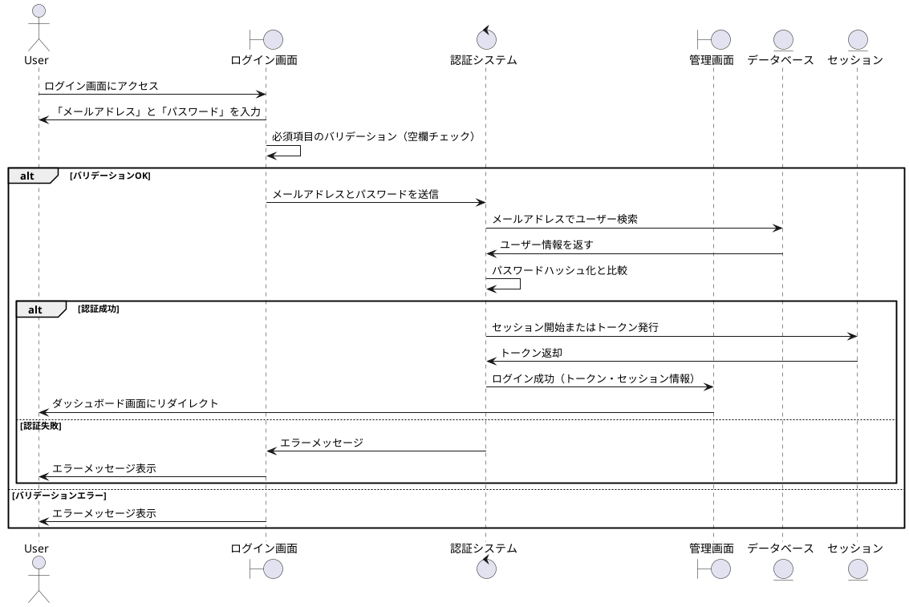
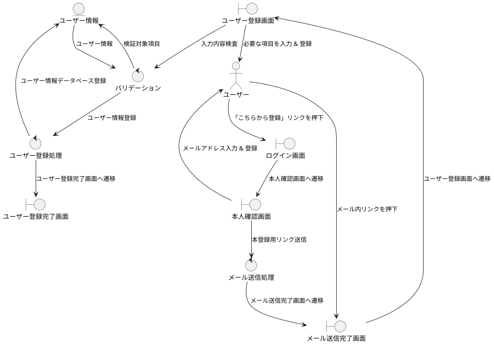

<style type="text/css">
  .reveal h1,
  .reveal h2,
  .reveal h3,
  .reveal h4,
  .reveal h5,
  .reveal h6 {
    text-transform: none;
  }

  .fullscreen {
  width: 100%;
  height: 100%;
  object-fit: cover;
}
</style>

# コードベースでできるあれこれ

---

# 自己紹介

---

### ニックネーム: ざっきー


得意なのは **Web フロントエンド** ですが、最近は興味本位で **Go** を触っています！

---

# コードベースでできるあれこれ

---

## GUI ツールを使った作業がたくさん！

- スライド作成: **PowerPoint**
- 設計書作成: **Word**  
  -バージョン管理: **Sourcetree**  
  -UML 作図: **astah**

---

## GUI ツールの魅力

- **直感的に操作可能**
- **初心者に優しい**
- **作業が効率的で便利**

---

## しかし...

---

## GUI ツールは万能ではない！

---

## 学校で本格的なシステム設計を行う機会がある

実装に入る前に機能、画面についての説明文とシーケンス図、ER 図のような UML を含めた設計書が必要

---

## UML の作図がとにかく面倒くさい！！

## 

---

### もっと簡単に UML を書く方法があるのではないか？

---

### コードベースで作図できる PlantUML というものを発見！！

---

### 実際に使ってみると、記法を覚えれば astah より手軽に作れて修正もしやすい

---

### コードベースのメリット

- Git でバージョン管理が出来る
- GitHub を使って、チーム作業しやすい
- 生成 AI や IT エンジニアと相性がいい

---

## ほかにもコードベースで作れるものがあるのではないか...？

---

### コードベースで作れるもの

1. #### astah → PlantUML（UML）
2. #### PowerPoint → vscode-reveal（スライド）
3. #### Word → Swagger（API 仕様書）

---

# PlantUML

VSCode を使ってコードで UML を作図できる

--

### 実際の開発画面

## .png>)

--

### PlantUML で作図できる UML

- ユースケース図
- ロバストネス図
- シーケンス図
- ER 図
- クラス図
- アクティビティ図
- 状態遷移図
- その他

--

### ログイン機能に関するシーケンス図を作ってみよう！！

--

### ログイン機能の処理手順

## .png>)

--

### 処理手順からコードを生成

## .png>)

--

### コードからシーケンス図を描画



--

### 微調整でいい感じの図に...！！



--

### astah と PlantUML を比較

- 設計メイン: astah
- 開発メイン: PlantUML

--

## plantUML はオブジェクトの配置を考えなくていい分、デメリットが...

--



#### 複雑な処理だと図が見にくい！

--

### 用途に合わせて使い分けよう！！

---

# vscode-reveal

VSCode を使ってマークダウンでスライドを作れる

--

### 実際の開発画面

## .png>)

--

### メリットとデメリット

- #### メリット

  - スライドの内容を技術記事などに流用しやすい
  - ガチればリッチなスライドを作れる
  - Web サイトとして公開でき、共有しやすい

- #### デメリット
  - プレゼンに特化した機能がない
  - ハードルが高め

--

### ちゃんと調べてもう少し使い続けたい

---

# swagger

### コードで API 仕様書を作れる

今回は Go で作った API に swaggo のアノテーションを設定して API 仕様書を生成

--

## API 仕様書

## .png>)

--

#### ハンドラー関数の上に swaggo アノテーションを記載

```go
// @Summary ログイン
// @Description メールアドレスとパスワードが合致したら、jwtトークンをCookieに保存
// @Tags auth
// @Param request body auth.LoginRequest true "ログイン情報"
// @Success 200 {object} utils.ApiResponse[LoginResponse] "成功"
// @Failure 400 {object} utils.BasicResponse "リクエストエラー"
// @Failure 404 {object} utils.BasicResponse "not foundエラー"
// @Failure 500 {object} utils.BasicResponse "内部エラー"
// @Router /api/auth/login [post]
func (h *AuthHandler) Login(c *gin.Context) {}
```

--

### フロントエンドエンジニアと連携しやすい

- #### 簡単に見やすい API 設計書ができる
- #### API のリクエストやレスポンスが見れる
- #### API の挙動確認が簡単

---

# デモ

---

## ご清聴ありがとうございました
